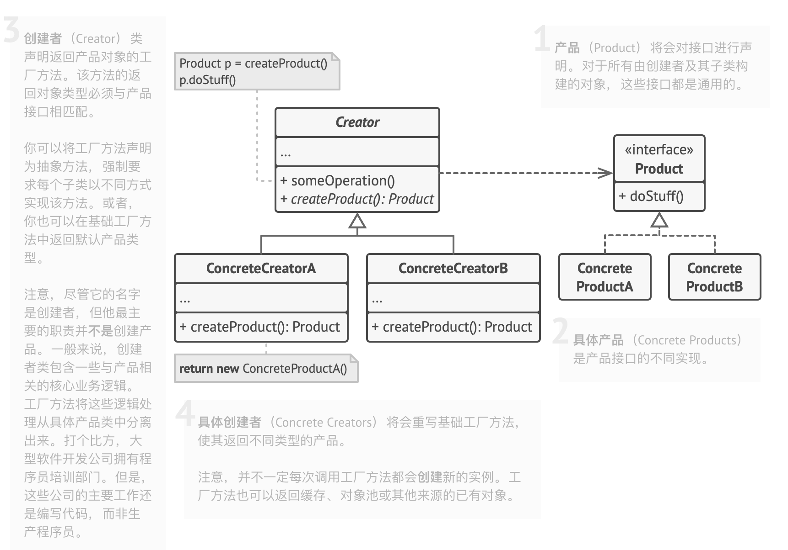

# 工厂方法模式

**亦称**：Factory Method


## 意图

****

**工厂方法模式**是一种创建型设计模式，其在父类中提供一个创建对象的方法，允许子类决定实例化对象的类型。


## 问题

****

假设你正在开发一款物流管理应用。最初版本只能处理卡车运输，因此大部分代码都在位于名为`卡车`的类中。


一段时间后，这款应用变得极首欢迎，你每天都能收到十几次来自海运公司的请求，希望应用能够支持海上物流功能。


<div align = "center"><font color='grey'>如果代码其余部分与现有类已经存在耦合关系，那么向程序中添加新类其实并没有那么容易</font></div>

这可是个好消息，但是代码问题该如何处理呢？目前，大部分代码都与`卡车`类相关，在程序中添加`轮船`类需要修改全部代码，更糟糕的是，如果你以后需要在程序中支持另一种运输方式，很可能需要再次对这些代码进行大幅修改。

最后，你将不得不编写繁复的代码，根据不同的运输对象类，在应用中进行不同的处理。


## 解决方案

----

工厂方法模式建议使用特殊的工厂方法代替对象构造函数的直接调用（即使用`new`运算符）。不用担心，对象仍将通过`new`运算符创建，只是该运算符改在工厂方法中调用罢了。工厂方法返回的对象通常被称作“产品”。


<div align="center"><font color = "grey" >子类可以修改工厂方法返回的对象类型</font></div>

乍看之下，这种更改可能毫无意义：我们只是改变了程序中调用构造函数的位置而已，但是，仔细想一下，现在你可以在子类中重写工厂方法，从而改变其创建产品的类型。

但是有一个需要注意：仅当这些产品具有共同的基类或者接口时，子类才能返回不同类型的产品，同时基类中的工厂方法还应将其返回类型声明为这一共有接口。


<div align="center"><font color='grey'>所有产品都必须使用同一接口。</font></div>

举例来说，`卡车(Truck)`和`轮船(Ship)`类都必须实现`运输Transport`接口，该接口声明了一个名为`deliver(交付)`的方法。每个类都将以不同的实现该方法：卡车走陆路交付货物，轮船走海路交付货物，`陆路运输`类中的工厂方法返回卡车对象，而`海路运输`类则返回轮船对象。


<div align='center'><font color='grey'>只要产品类实现一个共同的接口，你就可以将其对象传递给客户代码，而无需提供额外数据。</font></div>

调用工厂方法的代码（通常被称为**客户端**代码）无需了解不同子类返回实际对象之间的差别。客户端将所有产品是为抽象的`运输`。客户端知道所有运输对象都提供`交付`方法，但是并不关心其具体实现方式。


## 工厂方法模式结构

----




## 工厂方法模式适合应用场景

----

**当你在编写代码的过程中，如果无法预知对象确切类别及其依赖关系时，可使用工厂方法。**

工厂方法将创建产品的代码与实际使用产品的代码分离，从而能在不影响其他代码的情况下扩展产品创建部分代码。

例如，如果需要在应用中添加一种新产品，你只需要开发新的创建者子类，然后重写其工厂方法即可。


**如果你希望用户能扩展你软件库或框架的内部组件，可使用工厂方法。**

继承可能是扩展扩展软件或框架默认行为的最简单方法。但是当你使用子类代替标准组件时，框架如何辨识出该子类？

解决方案是将各框架中构造组件的代码集中到单个工厂方法中，并在继承该组件之外允许任何人对该方法进行重写。


**如果你希望复用现有对象来节省系统资源，而不是每次都重新创建对象，可使用工厂方法。**

在处理大型资源密集型对象（比如数据库连接、文件系统和网络资源）时，你会经常碰到这种资源需求。


让我们思考复用现有对象的方法：

1.  首先，你需要创建存储空间来存放所有已经创建的对象。
2.  当他人请求一个对象时，程序将在对象池中搜索可用对象。
3.  ...然后将其返回给客户端代码
4.  如果没有可用对象，程序则创建一个新对象（并将其添加到对象池中）。


这些代码可不少！而且它们必须位于同一处，这样才能确保重复代码不会污染程序。


可能最显而易见，也是最方便的方式，就是将这些代码放置在我们试图重用的对象类的构造函数中。但是从定义上来讲，构造函数始终返回的是**新对象**，其无法返回现有实例。


因此，你需要有一个既能够创建对象，又可以重用现有对象的普通方法，这听上去和工厂方法非常相似。


## 工厂方法模式优缺点

----

✅ 你可以避免创建者和具体产品之间的紧密耦合。

✅ 单一职责原则。你可以将产品创建代码放在程序的单一位置，从而使得代码更容易维护。

✅ 开闭原则。无需更改现有客户端代码，你就可以在程序中引入新的产品类型。

❌ 应用工厂方法模式需要引入许多新的子类，代码可能会因此变得更复杂。最好的情况是将该模式引入创建者类的现有层次结构中。


## 与其他模式的关系

----

-   在许多设计工作的初期都会使用工厂方法模式（较为简单，而且可以更方便地通过子类进行定制），随后演化为抽象工厂模式、原型模式或生产器模式（更灵活但更加复杂）。

    

-   **抽象工厂模式**通常基于一组**工厂方法**方法，但你也可以使用**原型模式**来生产这些类的方法。

    

-   你可以同时使用**工厂方法**和**迭代器模式**来让子类集合返回不同类型的迭代器，并使得迭代器与集合相匹配。

    

-   **原型**并不基于继承，因此没有继承的缺点。另一方面，原型需要对被复制对象进行复杂的初始化。**工厂方法**基于继承，但是它不需要初始化步骤。

    

-   **工厂方法**是**模版方法模式**的一种特殊形式。同时，工厂方法可以作为大型**模版方法**中的一个步骤。


## 代码实例

----

**抽象产品接口：Transport.java**

````java
package com.wy.design_pattern.factorymethod;

/**
 * @program: design_pattern
 * @description: 抽象产品：运输类
 * @author: WuYu
 * @create: 2021-06-21 23:50
 **/
public interface Transport {
		/**
     * 应该包含对所有具体产品都有意义的抽象方法
     */
    void doWork();

}
````


**具体产品：Truck.java**

````java
package com.wy.design_pattern.factorymethod;

import lombok.Data;

/**
 * @program: design_pattern
 * @description: 具体产品：卡车
 * @author: WuYu
 * @create: 2021-06-21 23:54
 **/
@Data
public class Truck implements Transport{
    @Override
    public void doWork() {
        System.out.println("卡车走公路运输货物！！！");
    }
}
````


**具体产品：Ship.java**

````java
package com.wy.design_pattern.factorymethod;

import lombok.Data;

/**
 * @program: design_pattern
 * @description: 具体产品：轮船
 * @author: WuYu
 * @create: 2021-06-21 23:54
 **/
@Data
public class Ship implements Transport{

    @Override
    public void doWork() {
        System.out.println("轮船走海路运输货物！！！");
    }
}
````


**基础创建者：Logistics.java**

````java
package com.wy.design_pattern.factorymethod;

/**
 * @program: design_pattern
 * @description: 创建者：运输
 * @author: WuYu
 * @create: 2021-06-21 23:44
 **/
public interface Logistics {

    /**
     * 请注意，创建者的主要职责并非是创建产品，其中通常会包含一些核心业务逻辑，
     * 这些逻辑依赖于由工厂方法返回的产品对象。子类可通过重写工厂方法并使其返回
     * 不同类型的产品来间接改变业务逻辑
     */
    default void doWork() {
        // 调用工厂方法创建一个产品对象
        Transport transport = createTransport();
        // 使用产品
        transport.doWork();
    };

    /**
     * 基础工厂方法：创建运输工具
     */
    Transport createTransport();
}
````


**具体创建者：RoadLogistics.java**

````java
package com.wy.design_pattern.factorymethod;

/**
 * @program: design_pattern
 * @description: 具体创建者：陆路运输
 * @author: WuYu
 * @create: 2021-06-21 23:45
 **/
public class RoadLogistics implements Logistics {

    @Override
    public Transport createTransport() {
        return new Truck();
    }
}

````


**具体创建者：SeaLogistics.java**

````java
package com.wy.design_pattern.factorymethod;

/**
 * @program: design_pattern
 * @description: 具体创建者：海路运输
 * @author: WuYu
 * @create: 2021-06-21 23:46
 **/
public class SeaLogistics implements Logistics{

    @Override
    public Transport createTransport() {
        return new Ship();
    }
}

````


**客户端代码**

````java

    static void main(String[] args) {
        doWorK(new SeaLogistics());
        doWorK(new RoadLogistics());
    }

    static void doWorK(Logistics logistics) {
        logistics.doWork();
    }
````


**运行结果**

````tex
轮船走海路运输货物！！！
卡车走公路运输货物！！！
````

