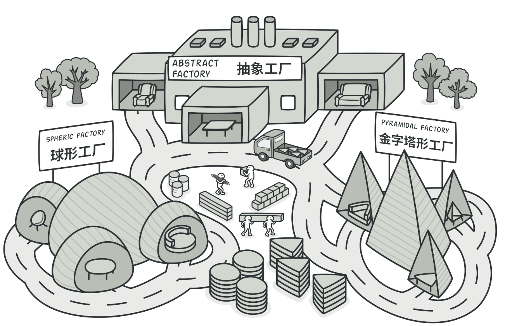
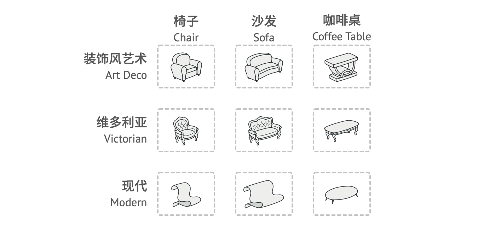
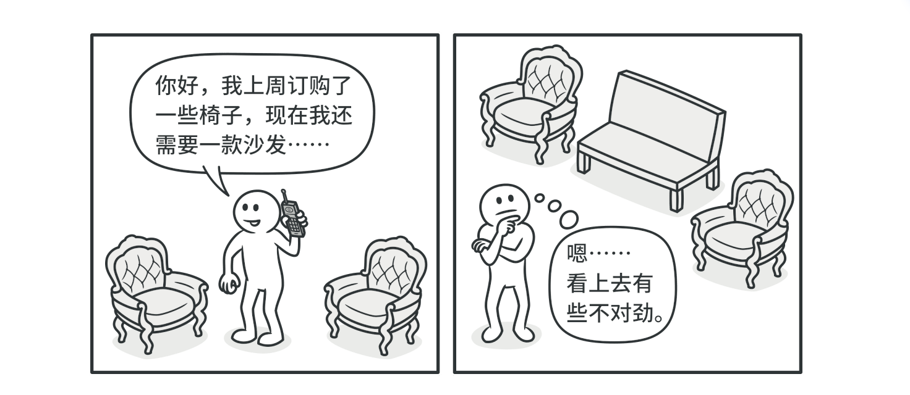
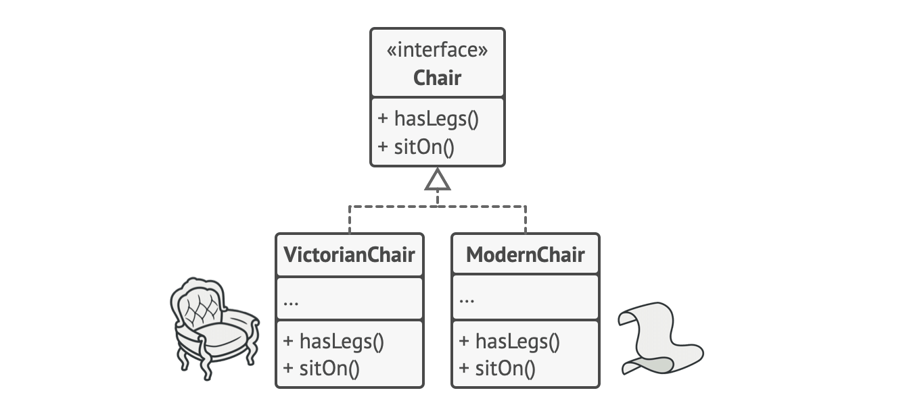
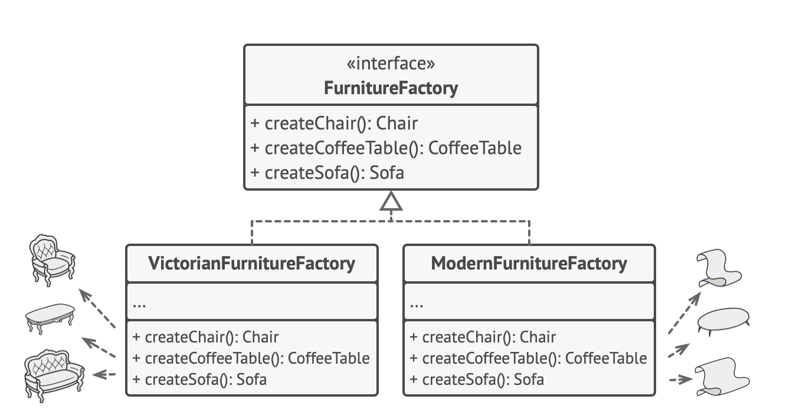
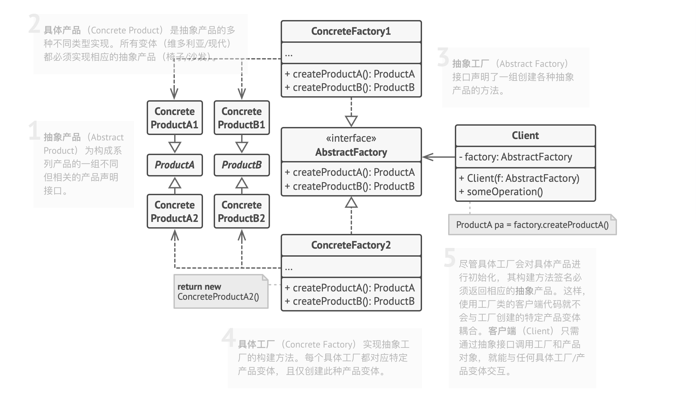

# 抽象工厂模式

**亦称**：Abstract Factory

## 意图

----

**抽象工厂模式**是一种创建型设计模式，它能创建一系列相关的对象，而无需指定其具体类。

## 问题

----

假设你正在开发一款家具商店模拟器。你的代码中包括一些类，用于表示：

1.  系列相关产品，例如`椅子(Chair)`、`沙发(Sofa)`和`咖啡桌(CofferTable)`。

    

2.  系列产品的不同变体，例如，你可以使用`现代(Modern`、`维多利亚(Victorian)`、`装饰风艺术(ArtDeco)`等风格生产`椅子`、`沙发`和`咖啡桌`。

系列产品及其不同变体。

你需要设法单独生成每个家具对象，这样才能确保其风格一致，如果顾客收到的家具风格不一样，他们可不会开心。

现代风格的沙发和维多利亚风格的椅子不搭。

此外，你也不希望在添加新产品或新风格是修改已有代码。家具供应商对于产品目录的更新非常频繁，你不会想在每次更新时都去修改核心代码的。

## 解决方案

首先，抽象工厂模式建议为系列中的每件产品明确声明接口（例如椅子、沙发或咖啡桌）。然后，确保所有产品变体都继承这些接口。例如，所有风格的椅子都实现`椅子`接口；所有风格的咖啡桌都实现`咖啡桌`接口，以此类推。

所有对象的所有变体都必须放置在同一个类层次结构之中

接下来，我们需要声明抽象工厂——包含系列中所有产品构造方法的接口，例如`createChair(创建椅子)`、`createSofa(创建沙发)`和`createCoffeeTable(创建咖啡桌)`。这些方法必须返回抽象产品类型，即我们之前抽取的那些接口：`椅子`、`沙发`和`咖啡桌`等等。

每个具体工厂类都对应一个特定的产品变体

那么该如何处理产品变体呢？对于系列产品的每个变体，我们都将基于`抽象工厂`接口创建不同的工厂类，每个工厂类都只能返回特定类别的产品，例如，`现代家具工厂(ModernFurnitureFactory)`只能创建`现代椅子(ModernChair)`、`现代沙发(ModernSofa)`和`现代咖啡桌(ModernCoffeeTable)`对象。

客户端代码可以通过相应的抽象接口调用工厂方法和产品类。你无需修改实际客户端代码，就能更改传递给客户端的工厂类，也能更改客户端代码接收的产品变体。

客户端无需了解其所调用工厂的具体类信息。

结社客户端想要工厂创建一把椅子。客户端无需了解工厂类，也不用管工厂类创建出的椅子类型，无论是现代风格，还是维多利亚风格的椅子，对于客户端来说没有分别，它只需调用抽象`椅子`接口就可以了。这样一来，客户端只需知道椅子以某种方式实现了`sitOn坐下`方法就足够了。此外，无论工厂返回的是何种椅子变体，它都会和由同一工厂对象创建的沙发或咖啡桌风格一致。

最后一点说明：如果客户端仅接触抽象接口，那么谁来创建实际的工厂对象呢？一般情况下，应用程序会在初始化阶段创建具体工厂对象。而在此之前，应用程序必须根据配置文件或环境设定选择工厂类别。

## 抽象工厂模式结构

----

